# PhoneLineRental
Project by Masum Uddin
## Introduction
This is a backend spring boot application that enables the frontend to access a PhoneLineRental database. It has full CRUD capability for both an Contract and a Customers table within the PhoneLineRental database. Using this application would make it easier to track and store the contracts of many customers. This readme outlines the detailed overview of the application's functionality, and provides evidence of testing and an explanation on how to successfully run the app.

## Functionality
* Creating new Contracts.
* Updating existing Contracts.
* Viewing a single Contracts by its ID.
* Viewing every Contracts.
* Creating new Customers.
* Updating existing Customers.
* Showing a single Customers by their ID.
* Showing every Customers.

## Tools and technologies

* Java.
* Eclipse.
* SpringBoot.
* Maven.
* MySQL.
* Git.
* Mockito.
* JUnit.

## Project structure
This Struture shows the outline of the phonelinerental project:

	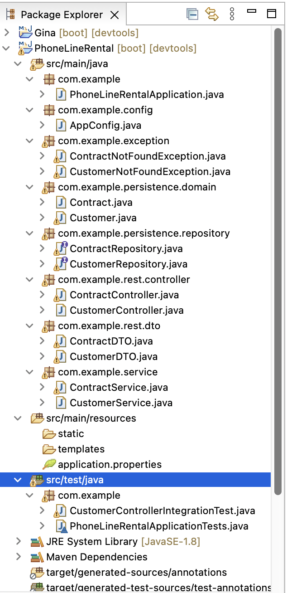
	
## Springboot Application
	The application of the springboot was run successfully as shown below:

	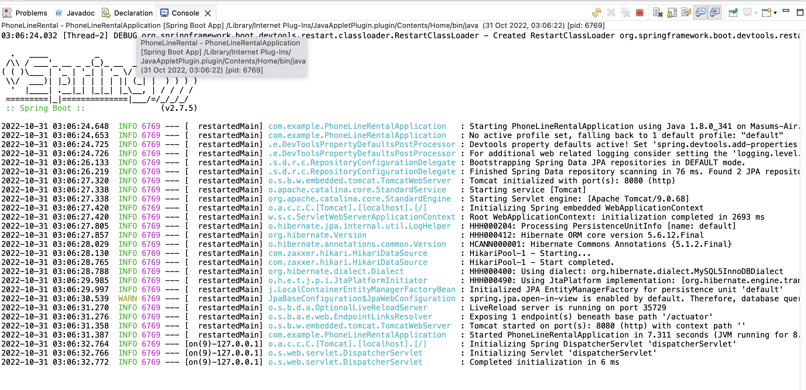

## **Entity Relationships**
 This is a relationship table between the Contract and Customer.

	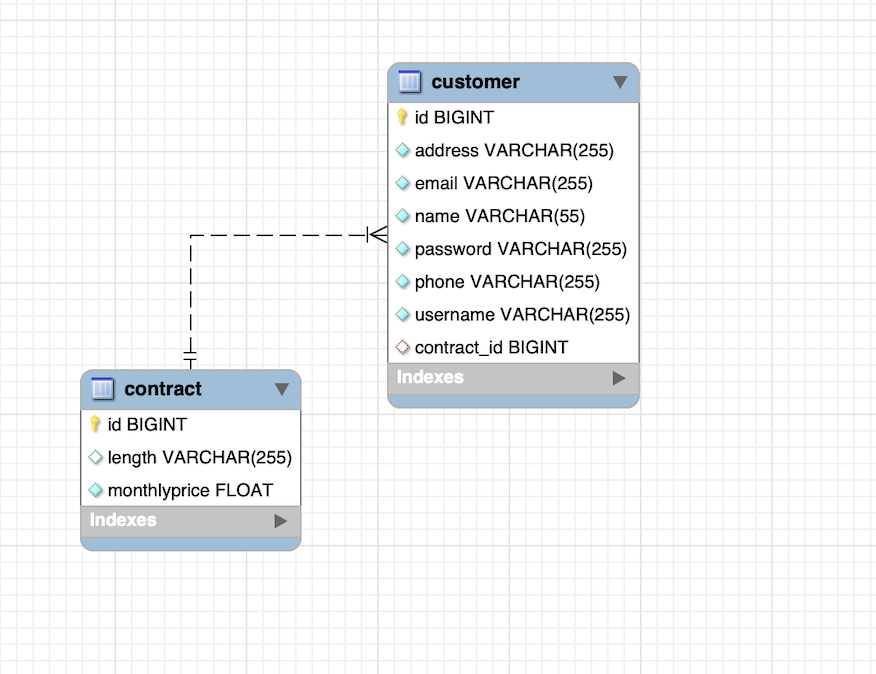

 

## Postman Fuctionalities

Add Customer

	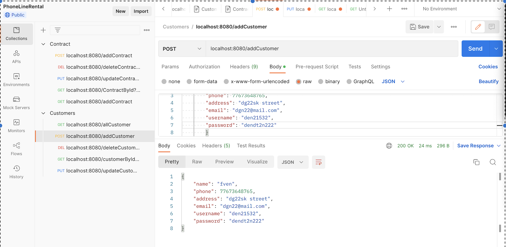
	
 
All Customer
	

	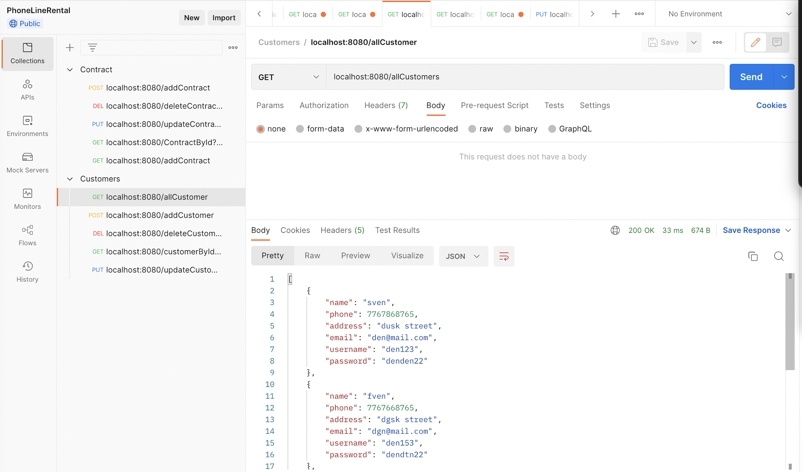
	
 
Update Customer
		

	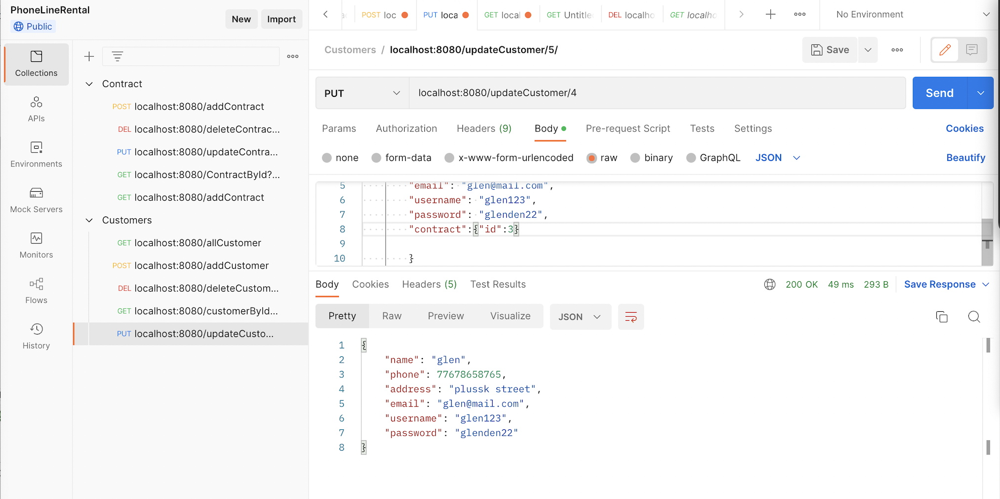
	
 
Delete Customer

	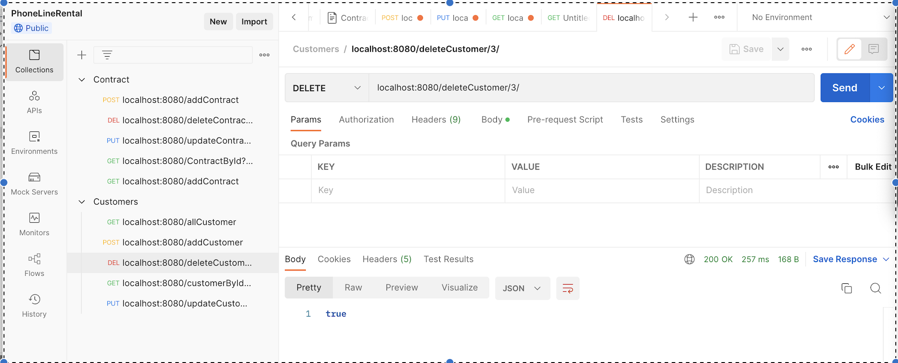
	
 
Add Contract

	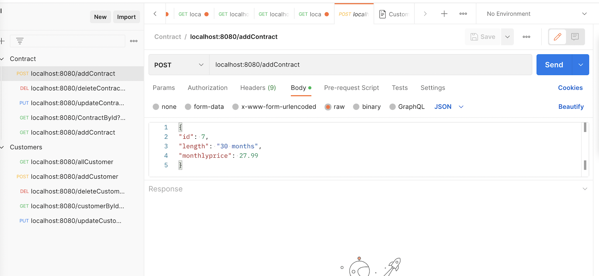
	
 
All Contract

	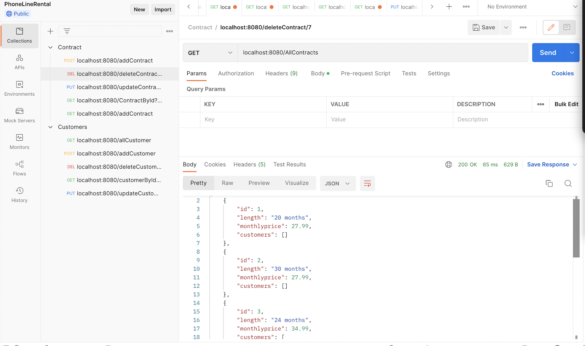
	
 
Update Contract

	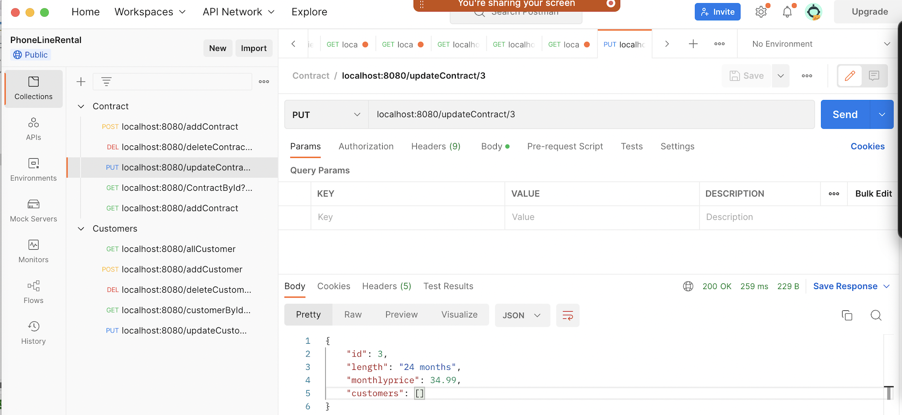
	
 
Delete Contract

	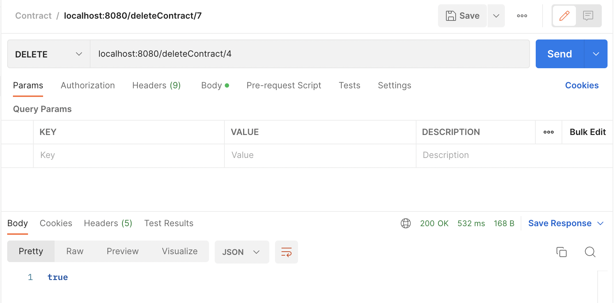

 
Customer Has A Contract

	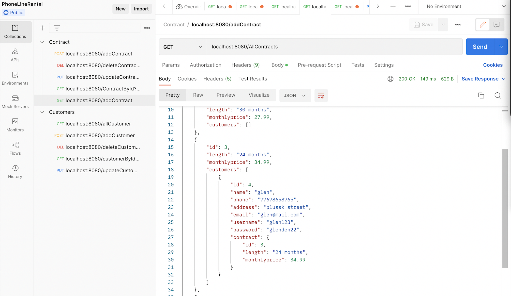

 

## Tutorials for running the Application
* The java is running on version 1.8.
* The port number on the application is 8080 and if in use must be stopped before running it again.
* The sql workbench port number should be 3306.
* The username and password in the application properties is correct to access the database.
* The tables will be created for the phone line rental which are Contract and Customer.
* Running postman to check the data stored in the database (SQL WorkBench).

## Testing
This testing has failed due to its complexity and is yet to solved in the near future

	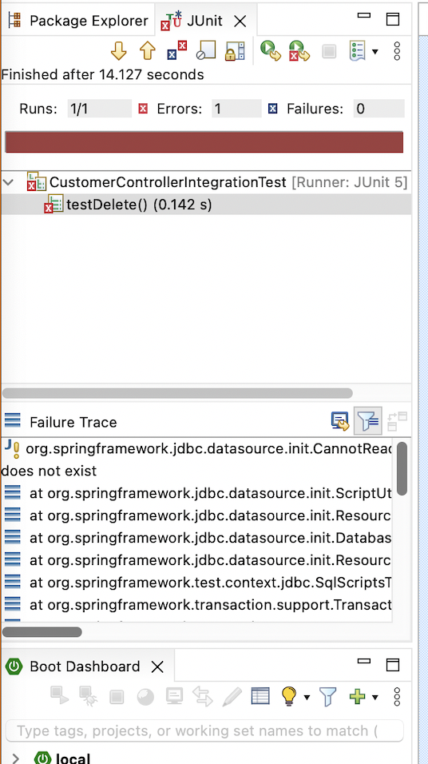

 

## Future Improvements
To create more tables to develop further understanding of complex relationships and problems. The project was done on a time constraint therefore it was done through urgency rather ones comfort. More time would have allowed all the errors to be fixed and would have allowed me to retain all the information learnt throughout this course. 
